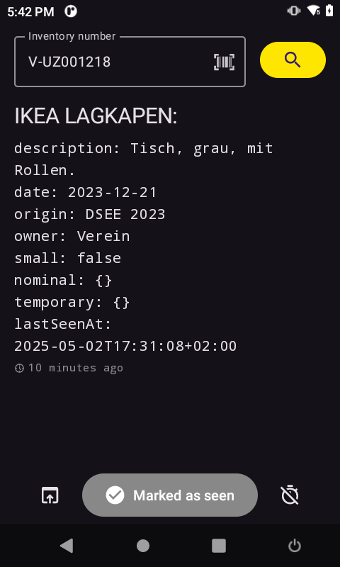

# tph Inventory Client

A quick and dirty inventory app for the [temporärhaus](https://temporaerhaus.de) [dokuwiki based inventory system](https://github.com/temporaerhaus/inventory-wiki) to mark items as seen.

## Features
- supports Android >= 6.0 (API 23) - so we can still use the torg devices with a connected barcode scanner
- inventory search via [barcode scanner](https://developers.google.com/ml-kit/vision/barcode-scanning/code-scanner) or keyboard input
- support for zebra devices with integrated barcode scanner (using intent based scanning)
- displays the current inventory details of an item
- allows to mark the scanned item as seen
- assigns the scanned item to the last scanned container item
- allows removal of temporary / permanent location
- detects external wifi, allows configuration of auth token
 
## Requirements
- Android >= 6.0 (API 23)
- [Google Play Services](https://developers.google.com/android/guides/overview) (for barcode scanning)
- enabled dokuwiki json rpc api

## Screenshots
